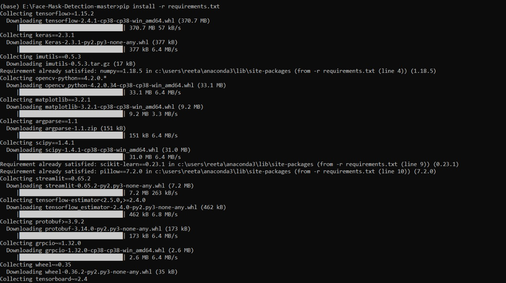

# Real-time-Face-mask-detector
In this time of the pandemic, wearing masks is mandatory. So I came up with an idea. An idea about making a real-time mask detection model using Python and ML. Eventually, this became my topic for the Artificial Intelligence project in college.

So without any further delay, let's dive right into it! [CODE AVAILABLE IN MASTER BRANCH]

# Hardware Requirements:

1. Quad-core processor(Intel/AMD) or higher

2. Dedicated NVIDIA GPU(Mx 250M or higher/GTX 750 Ti or higher)

3. 8GB 2333MHz RAM or higher

# Software Requirements:

Be very careful while installing all the required software, as incompatible software versions will cause conflicts in the upcoming steps. Install these ones one by one:

1. Anaconda - https://www.anaconda.com/products/individual

2. Python 3.8 - https://www.python.org/downloads/release/python-380/

3. Visual Studio - https://visualstudio.microsoft.com/downloads/

4. CUDA Toolkit - https://developer.nvidia.com/Cuda-Toolkit-Archive

5. CuDNN - https://developer.nvidia.com/rdp/cudnn-download

# Follow these steps to install CuDNN:

1. Download the latest cuDNN for CUDA 11.1

2. Download the library for Windows 10

3. Extract the contents of the zip file (i.e. the folder named cuda) inside <INSTALL_PATH>\NVIDIA GPU Computing Toolkit\CUDA\v11.1\, where <INSTALL_PATH> points to the installation directory specified during the installation of the CUDA Toolkit. By default <INSTALL_PATH> = C:\Program Files

# Setting up the environment -

1. Go to Start and Search “environment variables”

2. Click “Edit the system environment variables”. This should open the “System Properties” window

3. In the opened window, click the “Environment Variables…” button to open the “Environment Variables” window.

4. Under “System variables”, search for and click on the Path system variable, then click “Edit…”
Add the following paths, then click “OK” to save the changes:

       <INSTALL_PATH>\NVIDIA GPU Computing Toolkit\CUDA\v11.1\bin

       <INSTALL_PATH>\NVIDIA GPU Computing Toolkit\CUDA\v11.1\libnvvp

       <INSTALL_PATH>\NVIDIA GPU Computing Toolkit\CUDA\v11.1\extras\CUPTI\libx64

       <INSTALL_PATH>\NVIDIA GPU Computing Toolkit\CUDA\v11.1\cuda\bin
    

# Download all the contents from this link:
  GitHub has reduced the dataset from 8600 images to just 2000. In order to increase the accuracy of your model, you can download all the images from the link given below
    
  http://bit.ly/Face-Mask-Detection

# Steps for training the model begins:

1. Open "Anaconda Prompt" from the Start menu

2. Navigate to this above folder:

3. Now run the following command:

       pip install -r requirements.txt
       
It will show the following screen -

